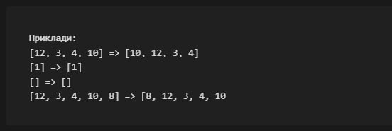
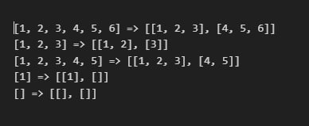

# Домашка 3

## Домашка 1

Ваша програма має перенести останній елемент списку з кінця на початок, тобто, останній елемент списку має стати першим. Послідовність інших елементів не має змінюватися.

Порожній список або список з одним елементом повинен залишитися незмінним.

Кількість елементів у списку може бути будь-яким – нуль та більше!

Для перевірки коректності роботи Вашого коду використовуйте приклади вище. Робити запит на введення даних від користувача не потрібно.

## Домашка 2

Програма має виконувати прості математичні дії (+, -, *, /). Користувачеві пропонується почерзі ввести числа та дію над цими числами, а програма, виходячи з дії, обчислює та друкує результат.

Зробити перевірку на те, що при діленні дільник не дорівнює 0!

## Домашка 3

Ваша програма повинна вміти розділяти один список на два та помістити їх у новий список. Тобто, в результаті повинен вийти список із 2-х списків.

Якщо в початковому списку непарна кількість елементів, то в першому списку має бути більше елементів.

Якщо у списку немає елементів, то має бути створений список із двома порожніми списками.

Важливо! Потрібно створити рішення, яке обробляє 3 випадки - список порожній, у списку парна кількість елементів і в списку непарна кількість елементів.

Приклади:

Було => стало

Для перевірки коректності роботи Вашого коду використовуйте приклади вище. Робити запит на введення даних від користувача не потрібно.